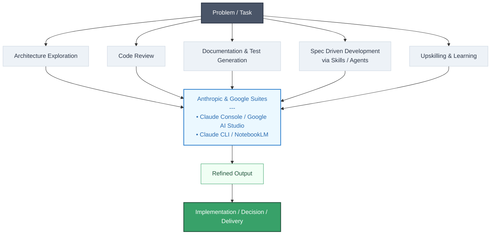

<pre>
░▒▓█▓▒░░▒▓█▓▒░▒▓████████▓▒░▒▓█▓▒░      ░▒▓█▓▒░      ░▒▓██████▓▒░  
░▒▓█▓▒░░▒▓█▓▒░▒▓█▓▒░      ░▒▓█▓▒░      ░▒▓█▓▒░     ░▒▓█▓▒░░▒▓█▓▒░ 
░▒▓█▓▒░░▒▓█▓▒░▒▓█▓▒░      ░▒▓█▓▒░      ░▒▓█▓▒░     ░▒▓█▓▒░░▒▓█▓▒░ 
░▒▓████████▓▒░▒▓██████▓▒░ ░▒▓█▓▒░      ░▒▓█▓▒░     ░▒▓█▓▒░░▒▓█▓▒░ 
░▒▓█▓▒░░▒▓█▓▒░▒▓█▓▒░      ░▒▓█▓▒░      ░▒▓█▓▒░     ░▒▓█▓▒░░▒▓█▓▒░ 
░▒▓█▓▒░░▒▓█▓▒░▒▓█▓▒░      ░▒▓█▓▒░      ░▒▓█▓▒░     ░▒▓█▓▒░░▒▓█▓▒░ 
░▒▓█▓▒░░▒▓█▓▒░▒▓████████▓▒░▒▓████████▓▒░▒▓████████▓▒░▒▓██████▓▒░  
:: owner:ivintoiu ::                                   (v.1.9.71)   
</pre>

## A long time ago, in a codebase far, far away... (。_。)

I was once a happy developer, but the flaws of legacy systems, outages, spaghetti code, and architectural crimes pushed me to learn the Matukay ways of engineering and leadership. Now, I forge high-performing software teams, architect and implement distributed systems, and eliminate chaos with scalability, reliability, and ruthless simplicity.

## Things I Wish Someone Told Me Earlier ¯\(°_o)/¯ 

- **Premature optimization** is the root of all evil.
- Good **software design** is like a joke - if you have to explain it, it's bad.
- The best **refactoring** is the one you don't need.
- Writing **tests** is great, but writing code that doesn't need tests is better.
- A **meeting** that could have been an email or chat is a defect in the process.
- Your **favorite tech stack** is just a Stockholm syndrome.
- There's no such thing as **'temporary' code**.
- **Writing documentation** it's an act of kindness to your future self or teammates.

## Tech Arsenal

- **Backend & Distributed Systems:** Java, Python, C#, Kafka, gRPC, Redis, RabbitMQ
- **Data & Storage:** PostgreSQL, SQL, caching strategies
- **Cloud & Infra:** AWS, Azure, Docker, k8s, Terraform
- **Delivery & Reliability:** GitHub Actions, CI/CD, SRE practices, observability pipelines

## AI Workflow

Architecture, code review, documentation, specs, and continuous learning are all accelerated by AI tooling.

>
> If you’ve read this far, you’re either a recruiter, a developer, or a very patient human. All are welcome.
> 

## Call to Action

Seeking a co-pilot to navigate complex hyperspace routes? Need assistance constructing a new base on Jedha? Send a transmission and let's align our forces to shape the balance of the galaxy.

- 🗨️ Discord:  @deviantr
- 🗨️ Substack: @ioan240298
- 🗨️ reddit:   u/ivi4reddit
- 🗨️ X:        @ioanvintoiu

---

  

