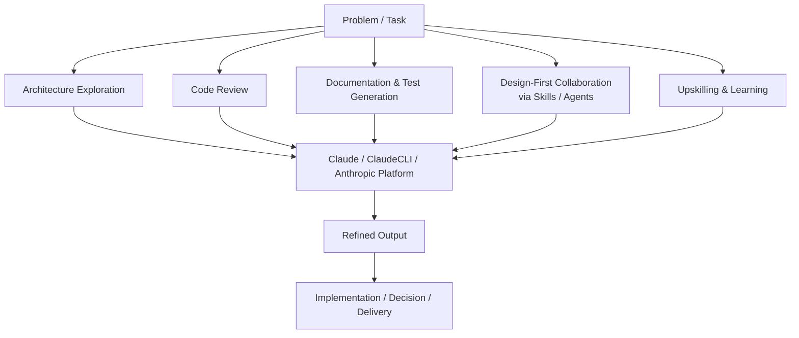

<pre>
░▒▓█▓▒░░▒▓█▓▒░▒▓████████▓▒░▒▓█▓▒░      ░▒▓█▓▒░      ░▒▓██████▓▒░  
░▒▓█▓▒░░▒▓█▓▒░▒▓█▓▒░      ░▒▓█▓▒░      ░▒▓█▓▒░     ░▒▓█▓▒░░▒▓█▓▒░ 
░▒▓█▓▒░░▒▓█▓▒░▒▓█▓▒░      ░▒▓█▓▒░      ░▒▓█▓▒░     ░▒▓█▓▒░░▒▓█▓▒░ 
░▒▓████████▓▒░▒▓██████▓▒░ ░▒▓█▓▒░      ░▒▓█▓▒░     ░▒▓█▓▒░░▒▓█▓▒░ 
░▒▓█▓▒░░▒▓█▓▒░▒▓█▓▒░      ░▒▓█▓▒░      ░▒▓█▓▒░     ░▒▓█▓▒░░▒▓█▓▒░ 
░▒▓█▓▒░░▒▓█▓▒░▒▓█▓▒░      ░▒▓█▓▒░      ░▒▓█▓▒░     ░▒▓█▓▒░░▒▓█▓▒░ 
░▒▓█▓▒░░▒▓█▓▒░▒▓████████▓▒░▒▓████████▓▒░▒▓████████▓▒░▒▓██████▓▒░  
:: owner:ivintoiu ::                                   (v.19.7.1)   
</pre>

## Engineering Leader, Distributed Systems Architect, and Passionate Developer
I build and scale engineering teams, design distributed systems, and help business turn ideas into production‑ready software.  

## A long time ago, in a codebase far, far away... (。_。)

I was once a mere developer, but the flaws of legacy systems and spaghetti code led me to the dark side of engineering. Now, I forge high-performing software teams, or architect and implement distributed systems as vast and unstoppable as the Empire itself.
I have mastered the ways of scalability, maintainability, reliability, availability, efficiency, and ruthless optimization. I do not simply learn. I assimilate knowledge.

## Things I Wish Someone Told Me Earlier ¯\(°_o)/¯ 

- **Premature optimization** is the root of all evil.
- Good **software design** is like a joke - if you have to explain it, it's bad.
- The best **refactoring** is the one you don't need.
- Writing **tests** is great, but writing code that doesn't need tests is better.
- A **meeting** that could have been an email or chat is a defect in the process.
- Your **favorite tech stack** is just a Stockholm syndrome.
- There's no such thing as **'temporary' code**.
- **Writing documentation** it's an act of kindness to your future self or teammates.

## Tech Arsenal

**Languages:** Java, Python, C#, SQL  
**Systems:** Kafka, Redis, PostgreSQL, gRPC, RabbitMQ  
**Cloud:** AWS, Azure  
**DevOps:** Docker, Kubernetes, Terraform, GitHub Actions 

## AI Workflow

## Call to Action (°▽°)/ 

Seeking a co-pilot to navigate complex hyperspace routes? Need assistance constructing a new base on Korriban? Send a transmission and let's align our forces.

- 🗨️ Discord:  @deviantr
- 🗨️ Substack: @ioan240298
- 🗨️ reddit:   u/ivi4reddit
- 🗨️ X:        @ioanvintoiu

